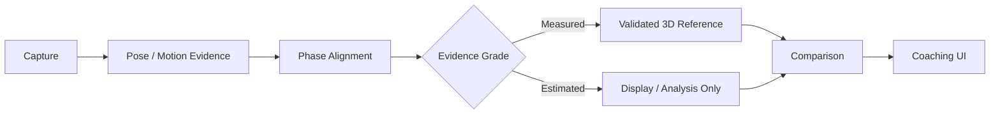
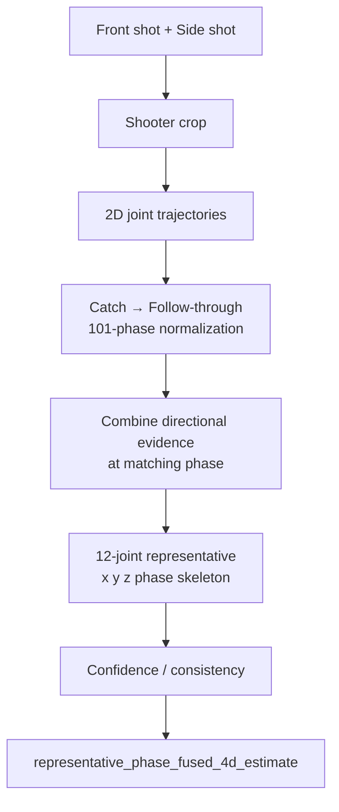
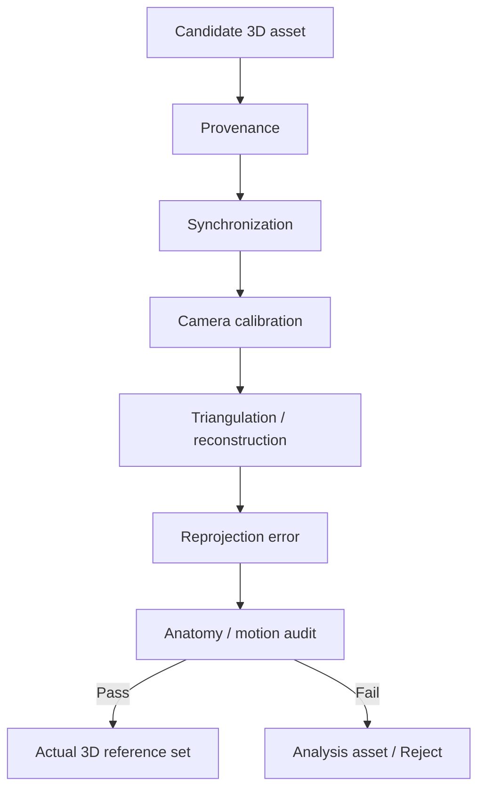
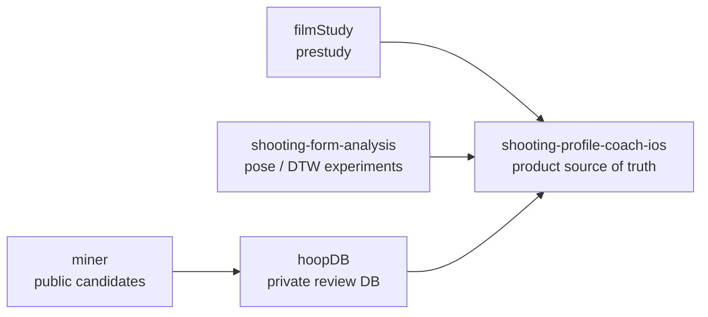

<div align="center">

# 🏀 FormPath Basketball

### Understand your shot. Don't fake the data.

**iPhone-first basketball shooting analysis with explicit evidence boundaries.**

<p>
  
  
  
  
</p>

[Project Map](docs/PROJECT_MAP.md) · [Implementation Status](docs/IMPLEMENTATION_STATUS.md) · [Workflow](docs/DEVELOPMENT_WORKFLOW.md) · [Todo](todo.md)

</div>

---

## Why FormPath exists

FormPath는 슛 영상을 멋있게 3D로 보이게 만드는 것보다 **어떤 데이터가 실제 측정이고 어떤 데이터가 추정인지 구분하는 것**을 더 중요하게 두는 농구 슈팅 분석 prototype입니다.

> ### 보기 좋은 3D ≠ 실제 측정된 3D

화면에 3D skeleton이 보인다는 이유만으로 `actual 3D`라고 부르지 않습니다. **표시 가능한 데이터**와 **추천 근거로 사용할 수 있는 데이터**도 따로 판단합니다.

## At a glance

| Area | What FormPath does |
|---|---|
| 📱 Capture | iPhone을 중심으로 슈팅 영상을 입력 |
| 🦴 Motion | 관절 trajectory와 슛 phase를 분석 |
| 🧭 Comparison | 같은 phase 기준으로 motion evidence를 비교 |
| 🧪 Evidence | actual / calibrated / estimated 데이터를 명확히 분리 |
| 🏀 Coaching | 검증된 근거만 recommendation path에 허용 |
| 🔒 Validation | provenance, reprojection, anatomy audit를 별도 gate로 사용 |

## Evidence-aware pipeline



핵심은 `D`입니다. **같아 보이는 데이터라도 생성 과정과 검증 수준이 다르면 같은 등급으로 취급하지 않습니다.**

## Data grades

| Data class | 화면 표시 | 추천 근거 |
|---|---|---|
| `actual_optical_mocap_3d` | audit 후 가능 | audit 후 가능 |
| `calibrated_multi_view_3d` | calibration·sync·reprojection 검증 후 가능 | product 승인 후 가능 |
| learned / monocular 3D estimate | **estimate 표시를 붙여서만 가능** | 사용 안 함 |
| source-faithful 2D / corrected relative analysis | 분석용 표시 가능 | actual 3D 근거로 사용 안 함 |
| separate-shot representative phase-fused 4D | private 검증 단계에서만 | reference-grade로 사용 안 함 |

learned 3D나 monocular estimate를 calibrated, metric, optical-mocap 또는 `actual 3D`로 다시 이름 붙이지 않습니다.

## Personal V2

정면 영상과 슈팅 측면 영상을 동시에 찍지 못하는 상황을 가정한 분석입니다. 따라서 이 경로를 triangulation 기반 실제 3D 복원이라고 부르지 않습니다.



- **Basic** — 1+1 촬영, confidence 상한 `0.65`
- **High** — 3+3 촬영에서 서로 일치하는 subset으로 대표 motion 구성

이 결과는 **서로 다른 슛을 phase 기준으로 합친 representative estimate**이며 synchronized calibrated 3D가 아닙니다. 검증이 끝나기 전까지 관련 feature flag는 기본 OFF입니다.

## Actual 3D admission

실제 3D reference로 들어가려면 출처 이름만으로 승인하지 않습니다.



현재 `cmu-shoot-01`은 승인된 optical-mocap shooting reference입니다.

Curry의 retained motion은 MotionBERT를 이용한 **learned image-to-3D display estimate**이며 actual calibrated 3D가 아닙니다. Paul George 데이터도 player-video-derived analysis motion으로 남아 있으며 actual 3D recommendation evidence에서 제외합니다.

## Repository map



이 저장소가 **FormPath 제품 개발의 중심 저장소**입니다. 다른 저장소에서 실험하거나 모은 결과가 있더라도 제품에서 무엇을 보여주고 무엇을 추천 근거로 쓸지는 여기의 데이터 경계와 검증 규칙을 기준으로 판단합니다.

## Docs

| 목적 | 문서 |
|---|---|
| 현재 구현 상태 | `docs/IMPLEMENTATION_STATUS.md` |
| product / data boundary | `docs/PROJECT_MAP.md` |
| 개발·test·checkpoint 규칙 | `docs/DEVELOPMENT_WORKFLOW.md` |
| multi-view capture | `docs/authorized-multiview-capture-kit.md` |
| uncalibrated reconstruction | `docs/UNCALIBRATED_RECONSTRUCTION_ALGORITHM.md` |
| 3D reconstruction script | `scripts/README.md` |
| representative 4D 검증 | `docs/representative-4d-validation-protocol.md` |
| 진행 기록 | `todo.md` |

## Development

```bash
pnpm install --frozen-lockfile
pnpm check
pnpm lint
pnpm test:unit
pnpm exec expo export --platform web --output-dir web-dist
```

multi-camera reconstruction을 직접 확인하려면 `docs/authorized-multiview-capture-kit.md`의 촬영·검증 순서를 따릅니다.

---

<div align="center">

**Measure what you can. Label what you estimate. Never confuse the two.**

</div>
