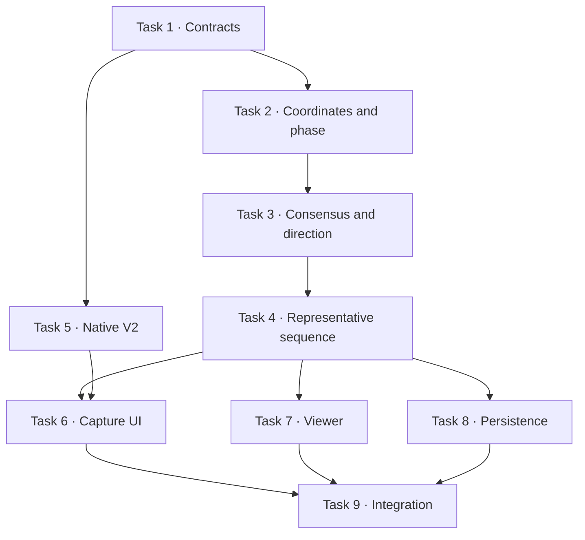

# Representative Dual-View 4D Project 1 Implementation Plan

> **For agentic workers:** REQUIRED SUB-SKILL: Use superpowers:subagent-driven-development (recommended) or superpowers:executing-plans to implement this plan task-by-task. Steps use checkbox (`- [ ]`) syntax for tracking.

**Goal:** Build a feature-gated iPhone flow that accepts separate front and shooting-side attempts in Basic 1+1 or High-accuracy 3+3 mode, produces a private 101-sample phase-normalized estimated skeleton trajectory, and preserves all V1 behavior.

**Architecture:** Add versioned V2 contracts beside the existing V1 pose types. Analyze every clip independently on-device, map all landmarks back to the upright source frame, normalize each attempt to shooting phase, aggregate attempts within each view, and reconstruct template-length 3D bone directions with explicit uncertainty and a non-metric evidence boundary. Store V2 profiles in new owner-only Firestore paths and render them through a dedicated full-trajectory viewer.

**Tech Stack:** Expo 54, React Native 0.81, TypeScript 5.9, Expo Router, Expo Modules Swift, AVFoundation, MediaPipe Tasks Vision, Firebase Authentication/Firestore, Zod 4, Vitest 2.

## Global Constraints

- Output boundary is exactly `representative_phase_fused_4d_estimate_not_actual_3d`.
- Basic mode is exactly one accepted front attempt plus one accepted shooting-side attempt and has a confidence cap of `0.65`.
- High-accuracy mode is exactly three accepted attempts per view and requires one deterministic agreeing subset of at least two complete attempts in each view.
- Output time basis is `normalized_shot_phase` with exactly 101 ordered samples from `0` through `1`.
- Separate-shot inputs must never enter `calibrated_multi_view_3d`, triangulation, fixed-F, or recommendation-admission paths.
- MediaPipe image-relative `z` must not enter V2 reconstruction or comparison.
- Cloud persistence may contain only left/right shoulder, elbow, wrist, hip, knee, and ankle landmarks; no filename, URI, EXIF, thumbnail, raw bytes, face, or head landmark.
- V1 `PersonalPoseCandidate`, five-frame `PoseMotion`, existing player/reference assets, and V1 read/delete behavior remain compatible.
- All V2 feature flags default off unless the corresponding `EXPO_PUBLIC_FORMPATH_*` environment value is `1`.
- Low-confidence input returns `recapture_required` and no reconstructed frames.
- Thresholds remain versioned engineering defaults and must not be presented as validated biomechanical truth.

---

## File structure

New domain files live under `lib/shooting-profile/` and do not import React, Firebase, or native modules. UI, persistence, and native adapters depend on the domain contracts, never the reverse.

```text
lib/shooting-profile/
  types.ts                 V2 contracts and evidence boundaries
  codec.ts                 Zod parsing and persistence allowlists
  capture-plan.ts          Basic/High-accuracy slot definitions
  coordinate-space.ts      crop/letterbox/rotation/mirror restoration
  phase-normalization.ts   phase anchors, monotone mapping, resampling
  repeated-shot.ts         agreeing-subset selection and robust aggregation
  direction-reconstruction.ts  projection-nullspace solver and conditioning
  kinematics.ts            fixed-length forward kinematics
  representative-sequence.ts  101-sample orchestration and quality result

components/shooting-profile/
  capture-mode-picker.tsx
  capture-slot-card.tsx
  capture-session.tsx
  sequence-viewer.tsx
  quality-summary.tsx
```

---

### Task 1: Feature flags and V2 contracts

**Files:**
- Create: `lib/feature-flags.ts`
- Create: `lib/shooting-profile/types.ts`
- Create: `lib/shooting-profile/codec.ts`
- Create: `lib/shooting-profile/capture-plan.ts`
- Create: `tests/shooting-profile-contract.test.ts`
- Create: `tests/shooting-profile-capture-plan.test.ts`

**Interfaces:**
- Produces: `FORMPATH_FLAGS`, `CaptureProtocolV2`, `CaptureSlotV2`, `LandmarkSequenceV2`, `RepresentativePose4DV2`, `parseRepresentativePose4D`, `buildCapturePlan`.
- Consumes: existing `JointName` and `Vector3` types only.

- [ ] **Step 1: Write failing flag and capture-plan tests**

```ts
import { describe, expect, it } from "vitest";
import { buildCapturePlan } from "@/lib/shooting-profile/capture-plan";

describe("buildCapturePlan", () => {
  it("creates two required slots for basic mode", () => {
    expect(buildCapturePlan("basic_1_plus_1").map(({ view, takeIndex }) => ({ view, takeIndex }))).toEqual([
      { view: "front", takeIndex: 0 },
      { view: "shooting_side", takeIndex: 0 },
    ]);
  });

  it("creates three front slots followed by three side slots", () => {
    expect(buildCapturePlan("high_accuracy_3_plus_3")).toHaveLength(6);
    expect(buildCapturePlan("high_accuracy_3_plus_3").map((slot) => slot.view)).toEqual([
      "front", "front", "front", "shooting_side", "shooting_side", "shooting_side",
    ]);
  });
});
```

- [ ] **Step 2: Run the tests and verify the missing-module failure**

Run: `pnpm exec vitest run tests/shooting-profile-capture-plan.test.ts tests/shooting-profile-contract.test.ts`

Expected: FAIL because the V2 modules do not exist.

- [ ] **Step 3: Implement exact V2 contracts and flags**

```ts
export type CaptureProtocolV2 = "basic_1_plus_1" | "high_accuracy_3_plus_3";
export type CaptureViewV2 = "front" | "shooting_side";
export type ShootingHandV2 = "left" | "right";
export type EvidenceBoundaryV2 = "representative_phase_fused_4d_estimate_not_actual_3d";

export type CaptureSlotV2 = {
  id: string;
  view: CaptureViewV2;
  takeIndex: 0 | 1 | 2;
  required: true;
};

export const FORMPATH_FLAGS = Object.freeze({
  captureV2: process.env.EXPO_PUBLIC_FORMPATH_CAPTURE_V2 === "1",
  representative4DViewer: process.env.EXPO_PUBLIC_FORMPATH_REPRESENTATIVE_4D === "1",
  profileV2: process.env.EXPO_PUBLIC_FORMPATH_PROFILE_V2 === "1",
});
```

`RepresentativePose4DV2` must require `schemaVersion: 2`, exactly 101 frames, `timeBasis: "normalized_shot_phase"`, template units, per-joint heuristic uncertainty, phase anchors, quality, and the exact evidence boundary. The Zod codec rejects unknown keys, non-finite numbers, any other boundary, non-monotonic phases, and frame counts other than 101.

- [ ] **Step 4: Implement capture plans and strict codec tests**

```ts
export function buildCapturePlan(mode: CaptureProtocolV2): CaptureSlotV2[] {
  const count = mode === "basic_1_plus_1" ? 1 : 3;
  return (["front", "shooting_side"] as const).flatMap((view) =>
    Array.from({ length: count }, (_, takeIndex) => ({
      id: `${view}-${takeIndex}`,
      view,
      takeIndex: takeIndex as 0 | 1 | 2,
      required: true as const,
    })),
  );
}
```

- [ ] **Step 5: Run contract, type, and legacy tests**

Run: `pnpm exec vitest run tests/shooting-profile-contract.test.ts tests/shooting-profile-capture-plan.test.ts tests/personal-pose.test.ts tests/pose-motion.test.ts`

Expected: all tests PASS.

- [ ] **Step 6: Commit Task 1**

```bash
git add lib/feature-flags.ts lib/shooting-profile/types.ts lib/shooting-profile/codec.ts lib/shooting-profile/capture-plan.ts tests/shooting-profile-contract.test.ts tests/shooting-profile-capture-plan.test.ts
git commit -m "feat: add representative shooting profile contracts"
```

---

### Task 2: Coordinate restoration and phase normalization

**Files:**
- Create: `lib/shooting-profile/coordinate-space.ts`
- Create: `lib/shooting-profile/phase-normalization.ts`
- Create: `tests/shooting-profile-coordinate-space.test.ts`
- Create: `tests/shooting-profile-phase-normalization.test.ts`

**Interfaces:**
- Consumes: `LandmarkSequenceV2`, `CaptureViewV2`, `ShootingHandV2` from Task 1.
- Produces: `restoreSourcePoint`, `restoreSourceLandmarks`, `detectPhaseAnchors`, `phaseAtTimestamp`, `resampleAttemptToPhaseGrid`.

- [ ] **Step 1: Write coordinate round-trip tests**

```ts
it("undoes a crop without confusing width and height scales", () => {
  const point = restoreSourcePoint({ x: 0.5, y: 0.25 }, {
    sourceWidth: 1920,
    sourceHeight: 1080,
    cropRectPx: { x: 480, y: 108, width: 960, height: 864 },
    contentRect: { x: 0, y: 0, width: 1, height: 1 },
    mirrored: false,
    rotationDeg: 0,
  });
  expect(point.x).toBeCloseTo(0.5, 6);
  expect(point.y).toBeCloseTo(0.3, 6);
});
```

Add fixtures for letterbox removal, horizontal mirror, and 90/180/270-degree rotation. The maximum source-pixel round-trip error is 0.5 px.

- [ ] **Step 2: Run coordinate tests and verify failure**

Run: `pnpm exec vitest run tests/shooting-profile-coordinate-space.test.ts`

Expected: FAIL because `restoreSourcePoint` does not exist.

- [ ] **Step 3: Implement source-coordinate restoration**

```ts
export function restoreSourcePoint(point: Point2, transform: SourceTransformV2): Point2 {
  const contentX = (point.x - transform.contentRect.x) / transform.contentRect.width;
  const contentY = (point.y - transform.contentRect.y) / transform.contentRect.height;
  const cropX = transform.cropRectPx.x + contentX * transform.cropRectPx.width;
  const cropY = transform.cropRectPx.y + contentY * transform.cropRectPx.height;
  return unrotateAndUnmirror(cropX, cropY, transform);
}
```

Reject non-finite coordinates, zero-sized rectangles, points outside the model content rectangle beyond a one-pixel tolerance, and transforms with unsupported rotations.

- [ ] **Step 4: Write phase-order and speed-invariance tests**

```ts
it("maps independently timed attempts to the same phase grid", () => {
  const fast = syntheticAttempt([0, 120, 260, 410, 620]);
  const slow = syntheticAttempt([0, 260, 620, 980, 1500]);
  const a = resampleAttemptToPhaseGrid(fast, knownAnchors(fast), 101);
  const b = resampleAttemptToPhaseGrid(slow, knownAnchors(slow), 101);
  expect(a.map((frame) => frame.phase)).toEqual(b.map((frame) => frame.phase));
  expect(a).toHaveLength(101);
});
```

- [ ] **Step 5: Implement ordered phase anchors and resampling**

`detectPhaseAnchors` selects the shooting wrist from `shootingHand`, combines wrist, elbow, pelvis, knee, and ankle motion, returns `releaseProxy`, and rejects missing or non-monotonic anchors. `resampleAttemptToPhaseGrid` returns exactly 101 frames with phases `index / 100` and never pairs front timestamps with side timestamps.

- [ ] **Step 6: Run Task 2 tests**

Run: `pnpm exec vitest run tests/shooting-profile-coordinate-space.test.ts tests/shooting-profile-phase-normalization.test.ts`

Expected: all tests PASS.

- [ ] **Step 7: Commit Task 2**

```bash
git add lib/shooting-profile/coordinate-space.ts lib/shooting-profile/phase-normalization.ts tests/shooting-profile-coordinate-space.test.ts tests/shooting-profile-phase-normalization.test.ts
git commit -m "feat: normalize shooting attempts to source space and phase"
```

---

### Task 3: Repeated-shot consensus and signed direction reconstruction

**Files:**
- Create: `lib/shooting-profile/repeated-shot.ts`
- Create: `lib/shooting-profile/direction-reconstruction.ts`
- Create: `tests/shooting-profile-repeated-shot.test.ts`
- Create: `tests/shooting-profile-direction.test.ts`

**Interfaces:**
- Consumes: 101-sample per-attempt phase sequences from Task 2.
- Produces: `selectAgreeingAttemptSubset`, `aggregateViewAttempts`, `reconstructBoneDirection`, `angleBetweenDirections`.

- [ ] **Step 1: Write deterministic 2-of-3 consensus tests**

```ts
it("uses one complete agreeing subset for the entire view", () => {
  const result = selectAgreeingAttemptSubset([takeA, takeB, outlierC], CONSENSUS_V1);
  expect(result.status).toBe("accepted");
  expect(result.attemptIds).toEqual([takeA.id, takeB.id]);
});

it("requires recapture when no complete pair agrees", () => {
  expect(selectAgreeingAttemptSubset([takeA, outlierB, outlierC], CONSENSUS_V1)).toEqual({
    status: "recapture_required",
    reason: "no_complete_agreeing_subset",
  });
});
```

- [ ] **Step 2: Run repeated-shot tests and verify failure**

Run: `pnpm exec vitest run tests/shooting-profile-repeated-shot.test.ts`

Expected: FAIL because the consensus module does not exist.

- [ ] **Step 3: Implement consensus before aggregation**

Enumerate candidate pairs in stable attempt-ID order. A pair passes only when all versioned required bones and phases meet angular, phase-anchor, and availability limits. Choose the lowest robust aggregate distance, then lexicographic attempt IDs as the deterministic tie-breaker. Include the third attempt only when it passes against the selected subset medoid.

- [ ] **Step 4: Write signed-quadrant and horizontal-degeneracy tests**

```ts
it("preserves downward bone direction", () => {
  const result = reconstructBoneDirection({ alpha: rad(135), beta: rad(180), verticalSign: -1, sideAxisSign: 1 });
  expect(result.status).toBe("accepted");
  expect(result.direction.y).toBeLessThan(0);
});

it("rejects a direction that is horizontal in both views", () => {
  expect(reconstructBoneDirection({ alpha: Math.PI / 2, beta: Math.PI / 2, verticalSign: 1, sideAxisSign: 1 }).status).toBe("rejected");
});
```

- [ ] **Step 5: Implement the projection-constraint nullspace solver**

```ts
const frontConstraint: Vector3 = { x: Math.cos(alpha), y: -Math.sin(alpha), z: 0 };
const sideConstraint: Vector3 = { x: 0, y: -Math.sin(beta), z: Math.cos(beta) };
const raw = cross(frontConstraint, sideConstraint);
const conditioning = length(raw) / Math.max(EPSILON, length(frontConstraint) * length(sideConstraint));
```

Normalize `raw`, orient it with the robust vertical sign, and reject `conditioning < 0.1`, front/side vertical-sign disagreement, non-finite values, or collapsed projected bones. `angleBetweenDirections` uses `atan2(length(cross), clamp(dot, -1, 1))`.

- [ ] **Step 6: Run Task 3 tests**

Run: `pnpm exec vitest run tests/shooting-profile-repeated-shot.test.ts tests/shooting-profile-direction.test.ts`

Expected: all tests PASS, including every signed-angle quadrant.

- [ ] **Step 7: Commit Task 3**

```bash
git add lib/shooting-profile/repeated-shot.ts lib/shooting-profile/direction-reconstruction.ts tests/shooting-profile-repeated-shot.test.ts tests/shooting-profile-direction.test.ts
git commit -m "feat: reconstruct robust phase-fused bone directions"
```

---

### Task 4: Representative sequence and fixed-length kinematics

**Files:**
- Create: `lib/shooting-profile/kinematics.ts`
- Create: `lib/shooting-profile/representative-sequence.ts`
- Create: `lib/shooting-profile/engineering-thresholds.ts`
- Create: `tests/shooting-profile-representative-sequence.test.ts`
- Create: `tests/fixtures/synthetic-dual-view.ts`

**Interfaces:**
- Consumes: restored, phase-normalized and per-view aggregated attempts plus direction results from Tasks 2-3.
- Produces: `buildRepresentativeSequence`, `forwardKinematicsFrame`, `ENGINEERING_THRESHOLDS_V1`.

- [ ] **Step 1: Write a synthetic golden reconstruction test**

```ts
it("recovers a finite 101-sample template-length trajectory", () => {
  const result = buildRepresentativeSequence(syntheticDualViewSession({ mode: "high_accuracy_3_plus_3", corruptTake: true }));
  expect(result.status).toBe("complete");
  expect(result.profile.frames).toHaveLength(101);
  expect(result.profile.boundary).toBe("representative_phase_fused_4d_estimate_not_actual_3d");
  expect(result.profile.frames.every(allCoordinatesFinite)).toBe(true);
  expect(maxBoneLengthError(result.profile)).toBeLessThan(1e-5);
});
```

Add tests that Basic confidence never exceeds 0.65, 3+3 uses the same per-view subset at every phase, root motion is either preserved or explicitly unavailable, and any failed critical bone returns no frames.

- [ ] **Step 2: Run the golden test and verify failure**

Run: `pnpm exec vitest run tests/shooting-profile-representative-sequence.test.ts`

Expected: FAIL because the sequence builder does not exist.

- [ ] **Step 3: Implement fixed-length forward kinematics**

```ts
export function forwardKinematicsFrame(directions: BoneDirectionMap, lengths: BoneLengthMap): JointMapV2 {
  const joints: Partial<JointMapV2> = { pelvis: { x: 0, y: 0, z: 0 } };
  for (const [parent, child] of SKELETON_BONES_V2) {
    const origin = joints[parent];
    const direction = directions[boneKey(parent, child)];
    if (!origin || !direction) throw new ReconstructionError("missing_critical_bone");
    joints[child] = add(origin, scale(direction, lengths[boneKey(parent, child)]));
  }
  return deriveNonPersistedDisplayJoints(joints as JointMapV2);
}
```

Head, neck, and spine are derived for display and never persisted as observations. Smooth unit directions and renormalize before forward kinematics; never interpolate Cartesian joints.

- [ ] **Step 4: Implement sequence orchestration and heuristic uncertainty**

`buildRepresentativeSequence` validates both views, applies Basic or High-accuracy aggregation, reconstructs all required bones at 101 phase samples, calculates versioned heuristic uncertainty, enforces the boundary, and returns either `{ status: "complete", profile }` or `{ status: "recapture_required", reason, affectedBones }`. A rejected result contains no `profile` or frames.

- [ ] **Step 5: Run domain and legacy suites**

Run: `pnpm exec vitest run tests/shooting-profile-*.test.ts tests/personal-pose.test.ts tests/pose-motion.test.ts tests/product-boundary-regression.test.ts`

Expected: all tests PASS and V1 tests are unchanged.

- [ ] **Step 6: Commit Task 4**

```bash
git add lib/shooting-profile/kinematics.ts lib/shooting-profile/representative-sequence.ts lib/shooting-profile/engineering-thresholds.ts tests/shooting-profile-representative-sequence.test.ts tests/fixtures/synthetic-dual-view.ts
git commit -m "feat: build representative 101-sample shooting trajectory"
```

---

### Task 5: Native detector V2 and build baseline

**Files:**
- Modify: `modules/formpath-pose/expo-module.config.json`
- Modify: `modules/formpath-pose/FormpathPose.podspec`
- Create: `modules/formpath-pose/ios/FormpathPoseResources.swift`
- Create: `modules/formpath-pose/ios/PoseSamplingPolicy.swift`
- Modify: `modules/formpath-pose/ios/FormpathPoseModule.swift`
- Modify: `modules/formpath-pose/src/FormpathPoseModule.ts`
- Create: `lib/pose-detection-v2.ts`
- Modify: `lib/pose-detection.native.ts`
- Create: `tests/pose-detection-v2-contract.test.ts`
- Modify: `docs/iphone-custom-build-qa.md`

**Interfaces:**
- Consumes: `AnalyzeClipRequestV2` and `LandmarkSequenceV2` contracts from Task 1.
- Produces: `analyzeClipAsync`, `cancelAnalysisAsync`, progress events, and `detectPoseClipV2`.

- [ ] **Step 1: Write static native-contract tests**

```ts
it("exposes additive V2 methods without removing V1", () => {
  const swift = readFileSync("modules/formpath-pose/ios/FormpathPoseModule.swift", "utf8");
  expect(swift).toContain('AsyncFunction("analyzeVideoAsync")');
  expect(swift).toContain('AsyncFunction("analyzeClipAsync")');
  expect(swift).toContain('AsyncFunction("cancelAnalysisAsync")');
  expect(swift).toContain('Events("onPoseAnalysisProgress")');
});
```

Add assertions for `apple.podspecPath`, a CocoaPods-compatible resource resolver, and truthful `attemptedFrames`, `detectedFrames`, and `rejectedFrames` fields.

- [ ] **Step 2: Run the native-contract test and verify failure**

Run: `pnpm exec vitest run tests/pose-detection-v2-contract.test.ts`

Expected: FAIL because the additive V2 bridge is absent.

- [ ] **Step 3: Fix module resolution and resource lookup**

Set `apple.podspecPath` to `FormpathPose.podspec`. Resolve `pose_landmarker_full.task` through `Bundle(for: FormpathPoseModule.self)` and the `FormpathPose.bundle` resource bundle, not `Bundle.module`. Keep the model file already present on GitHub and add a checksum/license verification step; do not duplicate it.

- [ ] **Step 4: Implement the sampling policy and real accounting**

```swift
struct PoseSamplingPolicy {
  static func coarseTimestamps(durationMs: Int) -> [Int] {
    stride(from: 0, through: durationMs, by: max(1, 1000 / 15)).map { $0 }
  }
}
```

Use `AVAssetImageGenerator.copyCGImage(at:actualTime:)` and return the actual presentation timestamp. Count every requested/attempted decode, successful detection, and rejection separately. Add a dense release-proxy pass capped at 30 fps. V2 must not use the current fixed sample count or report requested frames as detected frames.

- [ ] **Step 5: Add progress and cancellation**

Register `onPoseAnalysisProgress`; emit metadata, coarse pose, dense pose, quality, and complete stages. Track cancellation by `requestId` and check it before every frame iteration. Cancellation throws a stable `analysis_cancelled` code and never returns partial accepted output.

- [ ] **Step 6: Implement the TypeScript adapter**

```ts
export async function detectPoseClipV2(request: AnalyzeClipRequestV2, onProgress?: (event: PoseProgressV2) => void) {
  const result = await FormpathPose.analyzeClipAsync(request);
  return parseLandmarkSequenceV2(result);
}
```

Subscribe and unsubscribe by `requestId`, reject malformed/non-monotonic native output, and never place `uri` inside returned objects or logs.

- [ ] **Step 7: Run available verification**

Run: `pnpm exec vitest run tests/pose-detection-v2-contract.test.ts tests/pose-detection-contract.test.ts`

Run: `pnpm exec tsc --noEmit`

Expected: PASS. On a macOS runner, additionally run Expo autolinking resolution, clean prebuild, Pods install, simulator compile, and a bundled-model smoke test.

- [ ] **Step 8: Commit Task 5**

```bash
git add modules/formpath-pose lib/pose-detection-v2.ts lib/pose-detection.native.ts tests/pose-detection-v2-contract.test.ts docs/iphone-custom-build-qa.md
git commit -m "feat: add truthful native pose detector v2"
```

---

### Task 6: Capture-session reducer and accessible UI

**Files:**
- Create: `lib/shooting-profile/capture-session-reducer.ts`
- Create: `hooks/use-shooting-profile-capture.ts`
- Create: `components/shooting-profile/capture-mode-picker.tsx`
- Create: `components/shooting-profile/capture-slot-card.tsx`
- Create: `components/shooting-profile/capture-session.tsx`
- Create: `components/shooting-profile/quality-summary.tsx`
- Create: `app/private-capture.tsx`
- Modify: `components/private-pose-capture.tsx`
- Modify: `app.config.ts`
- Create: `tests/shooting-profile-capture-reducer.test.ts`

**Interfaces:**
- Consumes: flags and capture plans from Task 1, `detectPoseClipV2` from Task 5, `buildRepresentativeSequence` from Task 4.
- Produces: `captureSessionReducer`, `useShootingProfileCapture`, and the `/private-capture` route.

- [ ] **Step 1: Write reducer tests before UI code**

```ts
it("does not complete high-accuracy mode until all six slots pass", () => {
  let state = createCaptureSession("high_accuracy_3_plus_3", "right");
  for (const slot of state.slots.slice(0, 5)) state = captureSessionReducer(state, accepted(slot.id));
  expect(state.status).toBe("collecting");
  state = captureSessionReducer(state, accepted(state.slots[5].id));
  expect(state.status).toBe("ready_to_aggregate");
});

it("replacing one slot removes only that slot result", () => {
  const next = captureSessionReducer(acceptedBasicState(), { type: "RETAKE_SLOT", slotId: "front-0" });
  expect(next.slots.find((slot) => slot.id === "front-0")?.status).toBe("empty");
  expect(next.slots.find((slot) => slot.id === "shooting_side-0")?.status).toBe("accepted");
});
```

- [ ] **Step 2: Run reducer tests and verify failure**

Run: `pnpm exec vitest run tests/shooting-profile-capture-reducer.test.ts`

Expected: FAIL because the reducer does not exist.

- [ ] **Step 3: Implement the pure reducer and cleanup effects**

Reducer states are `mode_select`, `setup`, `collecting`, `aggregating`, `result_review`, `saving`, `complete`, and explicit error/cancel states. File deletion, native analysis, and Firebase writes remain hook effects and are never performed inside the reducer.

- [ ] **Step 4: Add camera/import permissions without a new dependency**

Use existing `expo-image-picker` for both `launchCameraAsync({ mediaTypes: ["videos"] })` and `launchImageLibraryAsync`. Add `NSCameraUsageDescription` and the matching image-picker camera permission text in `app.config.ts`.

- [ ] **Step 5: Build the guided capture route**

Every Pressable has at least a 44-point hit area, visible label, `accessibilityRole`, and state-aware `accessibilityLabel`. Errors use an accessibility live region and appear beside the affected slot. The mode picker states: Basic is a snapshot estimate; High accuracy measures repeatability. Capture all front slots before side slots.

- [ ] **Step 6: Feature-gate the V2 entry**

```tsx
return FORMPATH_FLAGS.captureV2
  ? <Pressable onPress={() => router.push("/private-capture")} accessibilityRole="button"><Text>정면·측면 슛폼 만들기</Text></Pressable>
  : <LegacyPrivatePoseCapture onSaved={onSaved} />;
```

- [ ] **Step 7: Run reducer, UI-static, type, and legacy tests**

Run: `pnpm exec vitest run tests/shooting-profile-capture-reducer.test.ts tests/release-readiness.test.ts tests/video-intake.test.ts`

Run: `pnpm exec tsc --noEmit`

Expected: PASS with V1 path unchanged when the flag is off.

- [ ] **Step 8: Commit Task 6**

```bash
git add lib/shooting-profile/capture-session-reducer.ts hooks/use-shooting-profile-capture.ts components/shooting-profile app/private-capture.tsx components/private-pose-capture.tsx app.config.ts tests/shooting-profile-capture-reducer.test.ts
git commit -m "feat: add guided dual-view capture sessions"
```

---

### Task 7: Full-trajectory viewer and private analysis route

**Files:**
- Create: `components/shooting-profile/sequence-viewer.tsx`
- Create: `app/private-analysis/[id].tsx`
- Create: `tests/shooting-profile-sequence-viewer.test.ts`
- Modify: `lib/pose-motion.ts` only if a shared display projection helper can remain V1-compatible.

**Interfaces:**
- Consumes: `RepresentativePose4DV2` from Task 1.
- Produces: `SequenceViewer`, `sampleRepresentativeFrame`, and a private profile detail route.

- [ ] **Step 1: Write exact phase-sampling tests**

```ts
it("uses source trajectory frames rather than five-pose interpolation", () => {
  const profile = syntheticRepresentativeProfile();
  expect(sampleRepresentativeFrame(profile, 0.505).phase).toBe(0.51);
  expect(profile.frames).toHaveLength(101);
});
```

Add tests that five phase anchors are markers only, playback pauses when the app is inactive, and reduced-motion mode disables autoplay.

- [ ] **Step 2: Run viewer tests and verify failure**

Run: `pnpm exec vitest run tests/shooting-profile-sequence-viewer.test.ts`

Expected: FAIL because the V2 viewer does not exist.

- [ ] **Step 3: Implement V2 trajectory sampling and projection**

`sampleRepresentativeFrame` clamps phase, maps it to integer sample `Math.round(phase * 100)`, and returns the stored frame. Projection may reuse display math but never calls `interpolatePoseFrame`.

- [ ] **Step 4: Build accessible playback UI**

Show Basic/High-accuracy mode, the persistent `위상 결합 4D 추정 · 실측 3D 아님` evidence label, confidence/recapture state, phase markers, play/pause, and front/oblique/side views. Respect reduced motion and app visibility.

- [ ] **Step 5: Run viewer and V1 motion tests**

Run: `pnpm exec vitest run tests/shooting-profile-sequence-viewer.test.ts tests/pose-motion.test.ts tests/product-boundary-regression.test.ts`

Expected: PASS without changing V1 interpolation behavior.

- [ ] **Step 6: Commit Task 7**

```bash
git add components/shooting-profile/sequence-viewer.tsx app/private-analysis tests/shooting-profile-sequence-viewer.test.ts lib/pose-motion.ts
git commit -m "feat: display full representative shooting trajectories"
```

---

### Task 8: V2 private persistence and profile compatibility

**Files:**
- Create: `lib/firebase-shooting-profile-contract.ts`
- Create: `lib/firebase-shooting-profiles.ts`
- Modify: `firestore.rules`
- Create: `components/shooting-profile/profile-list.tsx`
- Modify: `app/(tabs)/profile.tsx`
- Create: `tests/firebase-shooting-profile-contract.test.ts`
- Create: `tests/firestore-shooting-profile-rules.test.ts`

**Interfaces:**
- Consumes: strict V2 codec and `RepresentativePose4DV2` from Task 1.
- Produces: `saveShootingProfileV2`, `listShootingProfilesV2`, `getShootingProfileV2`, `deleteShootingProfileV2`.

- [ ] **Step 1: Write persistence redaction tests**

```ts
it("rejects forbidden media and landmark fields", () => {
  expect(validateShootingProfileWrite({ ...validWrite, filename: "me.mov" })).toContain("unknown_field");
  expect(validateObservationWrite({ ...validObservation, landmarks: [{ name: "nose", x: 0.5, y: 0.2 }] })).toContain("forbidden_landmark");
});
```

Add tests for the exact 12-joint observation allowlist, finite quantized coordinates, chunk order/count, evidence boundary, owner ID, schema version, and incomplete-session rejection.

- [ ] **Step 2: Run persistence tests and verify failure**

Run: `pnpm exec vitest run tests/firebase-shooting-profile-contract.test.ts tests/firestore-shooting-profile-rules.test.ts`

Expected: FAIL because the V2 contract and rules do not exist.

- [ ] **Step 3: Implement bounded V2 documents and chunks**

Use owner-scoped paths:

```text
/users/{uid}/captureSessions/{sessionId}/observations/{attemptId}/frameChunks/{chunkId}
/users/{uid}/motionProfiles/{profileId}/revisions/{revisionId}/sequenceChunks/{chunkId}
/users/{uid}/motionProfiles/{profileId}/revisions/{revisionId}/phaseSummaries/{phaseId}
```

Do not dual-write to V1 `/poses` or MySQL/tRPC. Create the completed profile head only after every required chunk and revision summary succeeds. On failure, leave no completed head and clean session-owned staging documents.

- [ ] **Step 4: Tighten Firestore rules**

Rules require authentication, matching UID, exact key allowlists, immutable ownership/revision fields, bounded strings/counts, and deny-by-default for other V2 paths. Legacy `/poses` keeps existing owner read/delete behavior.

- [ ] **Step 5: Add V2 profile list beside legacy records**

The profile tab dual-reads. V1 rows are labeled `기존 단일 시점 분석`; V2 rows show Basic snapshot or High-accuracy representative mode and open `/private-analysis/[id]`.

`deleteShootingProfileV2` first marks the owner profile head as `deletionState: "in_progress"`, enumerates known owner-scoped phase-summary, sequence-chunk, observation, and frame-chunk paths, deletes them in batches of at most 400 writes, and removes the profile head last. Reopening an interrupted deletion resumes from `in_progress`. The UI reports completion only after the head no longer exists.

- [ ] **Step 6: Run persistence, rules, type, and legacy tests**

Run: `pnpm exec vitest run tests/firebase-shooting-profile-contract.test.ts tests/firestore-shooting-profile-rules.test.ts tests/firebase-private-pose-contract.test.ts tests/firestore-rules.test.ts`

Run: `pnpm exec tsc --noEmit`

Expected: PASS. When the Firebase emulator is available, additionally prove same-owner access and cross-owner denial with real rule evaluation.

- [ ] **Step 7: Commit Task 8**

```bash
git add lib/firebase-shooting-profile-contract.ts lib/firebase-shooting-profiles.ts firestore.rules components/shooting-profile/profile-list.tsx app/'(tabs)'/profile.tsx tests/firebase-shooting-profile-contract.test.ts tests/firestore-shooting-profile-rules.test.ts
git commit -m "feat: persist private representative shooting profiles"
```

---

### Task 9: Integration gates, documentation, and rollout checkpoint

**Files:**
- Modify: `tests/release-readiness.test.ts`
- Modify: `tests/product-boundary-regression.test.ts`
- Create: `tests/representative-4d-integration.test.ts`
- Modify: `docs/DEVELOPMENT_WORKFLOW.md`
- Modify: `docs/iphone-custom-build-qa.md`
- Modify: `docs/MOBILE_PRODUCT_POLICY.md`
- Create: `docs/representative-4d-validation-protocol.md`
- Modify: `README.md`

**Interfaces:**
- Consumes: every Project 1 module.
- Produces: one feature-gated end-to-end integration contract and honest release documentation.

- [ ] **Step 1: Write the boundary integration test**

```ts
it("builds only an estimated profile from separate shots", async () => {
  const profile = buildRepresentativeSequence(validBasicFixture());
  expect(profile.status).toBe("complete");
  expect(profile.profile.boundary).toBe("representative_phase_fused_4d_estimate_not_actual_3d");
  expect(JSON.stringify(profile)).not.toContain("calibrated_multi_view_3d");
  const observationPayload = serializeObservationForCloud(validFrontObservation());
  expect(JSON.stringify(observationPayload)).not.toContain('"z":');
});
```

The reconstructed profile must contain estimated output `z`; only serialized source observations forbid MediaPipe `z`.

- [ ] **Step 2: Add build/resource and privacy regression checks**

Check feature flags default off, V1 route remains present, podspec resolution is configured, the task resource checksum record exists, V2 serialized observations include only the allowed 12 joints, and filenames/URIs are absent.

- [ ] **Step 3: Document the validation protocol**

The protocol names required synthetic and real-user datasets, sample sizes, ground-truth method, right/left hand coverage, body-size and camera-orientation coverage, false-accept/false-reject targets, angular error targets, repeatability thresholds, and the rule that heuristic uncertainty cannot be labeled 95 percent without held-out coverage evidence.

- [ ] **Step 4: Run full available verification**

Run: `pnpm exec tsc --noEmit`

Run: `pnpm exec vitest run`

Run: `pnpm exec expo lint`

Run: `pnpm exec expo export --platform web --output-dir web-dist`

Expected: TypeScript, unit/integration tests, lint, and web export PASS. Record environment-dependent Firebase and native/device checks separately rather than marking them passed.

- [ ] **Step 5: Execute physical iPhone acceptance**

Verify Camera and Photos permissions, Basic and High-accuracy completion, left/right hand, portrait/landscape, HEVC, slow motion, variable frame rate, 2-second and 20-second clips, real progress, cancellation, background interruption, retake, full 101-sample playback, airplane-mode processing, reopen, other-account denial, and deletion. Do not enable production flags until these checks pass.

- [ ] **Step 6: Commit Task 9**

```bash
git add tests docs README.md
git commit -m "test: gate representative dual-view shooting profiles"
```

---

## Parallel execution graph



After Task 1 lands, Task 2 and Task 5 may run in parallel. After Task 4 lands, Task 7 and Task 8 may run in parallel while Task 6 waits for both Task 4 and Task 5. Task 9 is the integration checkpoint.

## Project 1 completion boundary

Project 1 is implemented when Tasks 1-9 are committed and all environment-available gates pass. Physical iPhone, macOS/Xcode, and Firebase-emulator checks remain explicit blockers if those environments are unavailable; they must not be reported as passed. Comparison/coaching, reference styles, peer ranges, and sharing require separate implementation plans after Project 1 data quality is demonstrated.
