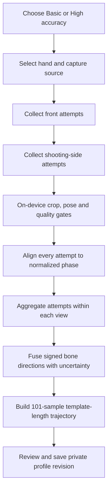

# Representative Dual-View 4D Shooting Profile Design

Status: proposed design for review  
Repository: `Rudwpahs/shooting-profile-coach-ios`  
Date: 2026-08-22

## 1. Decision

The product will support two practical capture modes made from separate repeated shots:

- **Basic:** one accepted front shot plus one accepted shooting-side shot.
- **High accuracy:** three accepted front shots plus three accepted shooting-side shots, with robust per-view aggregation and outlier rejection.

The output is a 101-sample skeleton trajectory over normalized shooting phase, represented as `x, y, z, tau`. It is not a synchronized measurement of one physical shot. Its evidence boundary is fixed in code as:

`representative_phase_fused_4d_estimate_not_actual_3d`

Basic mode is shown as a **two-view snapshot estimate**. High-accuracy mode is shown as a **representative form estimate** only after at least two of three attempts agree in each view. Neither mode may be serialized, displayed, recommended, or shared as calibrated, metric, measured, or actual 3D.

The existing synchronized and calibrated multi-camera triangulation pipeline remains separate and keeps the boundary `calibrated_multi_view_3d`.

## 2. Delivery decomposition

The full product is divided into four independently gated projects:

1. **Capture and representative reconstruction:** 1+1 and 3+3 input, phase alignment, a 101-sample estimated skeleton trajectory, confidence, and private profile storage.
2. **Personal comparison and coaching:** compare a user with their prior sessions and emit evidence-linked coaching cues.
3. **Pseudonymous reference styles:** compare compatible derived metrics with licensed or consented style profiles without exposing athlete identity in the consumer app.
4. **Sharing and peer ranges:** consented, minimized sharing and aggregate peer ranges with privacy thresholds.

Project 1 is the first implementation target. Projects 2-4 build only on versioned Project 1 contracts and remain disabled until their data and privacy gates pass.

## 3. Non-goals

- Do not pair front and side frames by wall-clock timestamp.
- Do not run epipolar geometry, fixed-F fitting, or triangulation on separate shots.
- Do not use MediaPipe image-relative `z` as measured depth.
- Do not infer ball release without ball tracking; use the term `releaseProxy`.
- Do not convert old single-video records into multi-shot records.
- Do not expose a precise player-match percentage when uncertainty is unknown.
- Do not call a single-athlete-derived style anonymous; it is pseudonymous unless it is a reviewed cohort aggregate.

## 4. End-to-end flow



Front and side attempts retain independent source timestamps. The fused output uses normalized phase `tau` in `[0, 1]`, not real-world synchronized time.

## 5. Capture experience

`PrivatePoseCapture` becomes a small entry card. A full-screen capture route owns the session.

### 5.1 Session steps

1. Choose Basic or High accuracy.
2. Confirm shooting hand.
3. Choose Record or Import for each slot.
4. Capture all front attempts first.
5. Move the phone once and capture all shooting-side attempts.
6. Analyze each clip immediately on device and accept or retake it.
7. Review session quality and the estimated result.
8. Explicitly save the private profile.

Basic requires two accepted slots. High accuracy requires six accepted slots.

### 5.2 Slot state machine

`instructions -> acquiring -> preview -> metadataCheck -> poseAnalysis -> accepted`

Retryable failures return to `acquiring`. Permission blocking, missing native capability, cancellation, background interruption, and save failure have explicit recovery states. Retaking one clip removes only that session-owned temporary media and its derived frames. Imported originals in the user's library are never deleted.

### 5.3 UX requirements

- Show a visible step count and real processing progress.
- Explain why a clip failed and provide one direct recovery action.
- Use at least 44-by-44-point touch targets, visible labels, screen-reader announcements for progress/errors, and reduced-motion support.
- Keep Basic and High accuracy descriptions factual: High accuracy measures repeatability; it does not create calibrated 3D.
- Place evidence text beside the result title, not in hidden fine print.

## 6. Native pose-analysis contract

The Expo module name is standardized as `FormpathPose`. The current V1 method remains for compatibility. V2 is additive:

```ts
type AnalyzeClipRequestV2 = {
  requestId: string;
  uri: string;
  view: "front" | "shooting_side";
  shootingHand: "left" | "right";
  takeIndex: 0 | 1 | 2;
  profile: "personal_v2";
};

type AnalyzeClipResultV2 = {
  version: 2;
  metadata: {
    durationMs: number;
    displayWidth: number;
    displayHeight: number;
    nominalFrameRate: number;
    frameRateMode: "constant" | "variable" | "unknown";
    attemptedFrames: number;
    decodedFrames: number;
    detectedFrames: number;
    rejectedFrames: number;
  };
  frames: Array<{
    timestampMs: number;
    sourceLandmarks: NativePoseLandmark[];
    cropRectPx: { x: number; y: number; width: number; height: number };
    modelToSourcePx: number[];
  }>;
  transformConvention: "upright_source_top_left_v1";
  quality: ClipQualityReportV2;
};
```

Methods and events:

- `analyzeClipAsync(request)`
- `cancelAnalysisAsync(requestId)`
- `onPoseAnalysisProgress(event)`

Analysis decodes real presentation timestamps, supports variable-rate clips, and reports attempted and detected frames separately. It uses a regular analysis pass around 15 fps and a denser pass up to 30 fps around the release-proxy window. The fixed 24-frame policy is removed from V2.

The bridge never returns filenames, thumbnails, raw bytes, or persistent media identifiers. Application-controlled logs, analytics, crash payloads, and cloud writes redact URIs and filenames.

## 7. Coordinate restoration and crop handling

Cropping is used only to improve detection. All landmarks are restored to the upright source image before angles are calculated.

For a crop `(x0, y0, cropWidth, cropHeight)`:

```text
sourceX = (x0 + cropNormalizedX * cropWidth) / sourceWidth
sourceY = (y0 + cropNormalizedY * cropHeight) / sourceHeight
```

If the model input is letterboxed, padding and model scaling are inverted first. A stored affine transform must undo letterboxing, ROI crop, mirror, rotation, and source normalization. Downstream modules reject crop-relative points.

The product keeps two coordinate spaces:

- **Body frame:** pelvis-rooted and scaled by a stable torso measure for pose shape.
- **Motion frame:** one fixed transform per clip to preserve relative dip, jump, and lateral drift.

Side-view shoulder width is never used as the scale because it is foreshortened.

## 8. Phase normalization

Each shot independently detects ordered anchors:

`ready -> deepestDip -> rise -> releaseProxy -> followThrough`

Between anchors, source time is mapped monotonically onto a canonical phase `tau` in `[0, 1]`. Each accepted shot is resampled onto 101 phase samples. Source anchor timestamps and phase-duration ratios are retained as observed features, but front and side source timestamps are never paired.

Phase detection uses the selected shooting wrist plus elbow, pelvis, knee, and ankle signals. It must support both hands and reject missing, duplicated, or non-monotonic anchors. Constrained DTW may refine alignment only inside the corresponding phase intervals.

## 9. Repeated-shot aggregation

High-accuracy mode first selects one deterministic agreeing subset of at least two complete attempts per view, using versioned required-bone, phase, and angular thresholds. The same subset is used throughout that view. The third attempt is included only if it passes the same complete-attempt agreement test. If no subset passes in either view, the session returns `recapture_required` and produces no profile.

After subset selection, High-accuracy mode aggregates attempts separately within each view before front/side fusion.

For each bone and phase sample:

1. Compute a confidence-weighted circular medoid of the three signed projected directions.
2. Compute circular median absolute deviation.
3. Reject observations outside the greater of `3 * MAD` and 8 degrees.
4. Require support from every attempt in the selected agreeing subset.
5. Fail the affected critical bone when retained spread exceeds an initial 12-degree engineering threshold.

The thresholds are not biomechanical truths; fixture and real-user validation must calibrate them before release. The algorithm never creates nine artificial cross-view shot pairs.

Basic mode has no repeatability evidence and therefore caps overall reconstruction confidence at 0.65.

## 10. Signed 3D bone-direction estimate

For a parent-to-child bone, after image y is converted to up:

```text
front = (deltaXFront, deltaYFront)
sideX = sideAxisSign * rawDeltaXSide
side  = (sideX, deltaYSide)
alpha = atan2(deltaXFront, deltaYFront)
beta  = atan2(sideX, deltaYSide)
```

The proposed tangent formula is retained as a mathematical reference:

```text
q = verticalSign * normalize(tan(alpha), 1, tan(beta))
```

`verticalSign` is a robust signed estimate of the bone's vertical direction. Reliable front/side vertical signs that disagree cause rejection.

Production avoids tangent singularities. It solves the projection constraints with SVD:

```text
A = [[cos(alpha), -sin(alpha), 0],
     [0, -sin(beta), cos(beta)]]
```

The unit right-singular vector associated with the smallest singular value is the estimated direction and is oriented by `verticalSign`. This is equivalent to the tangent construction away from horizontal poses and remains finite near 90 degrees.

If both views are nearly horizontal, angle-only reconstruction cannot determine the x-to-z ratio. A scale-assisted fallback is allowed only when per-view scale dispersion is low and the projected bone is sufficiently long. Otherwise the bone and any dependent advice fail closed.

The angle between reconstructed bones uses:

```text
theta = atan2(length(cross(q1, q2)), clamp(dot(q1, q2), -1, 1))
```

## 11. Skeleton construction, smoothing and uncertainty

The fused directions are converted into a skeleton by forward kinematics:

```text
child(tau) = parent(tau) + templateBoneLength * direction(tau)
```

Generic adult ratios are an initial display template. When a profile includes height or wingspan, the template may be scaled for display, but it remains an estimate and not a subject measurement.

The pipeline smooths confident 2D trajectories before angle extraction, then smooths unit bone directions on the unit sphere and renormalizes them. It does not linearly interpolate Cartesian joints because that changes bone length.

Root translation is stored separately when the motion-frame transform is reliable. If crop or camera motion makes it unreliable, the output is body-relative and explicitly marks root motion unavailable.

Uncertainty is estimated by a versioned landmark/phase perturbation model in Basic mode and whole-shot resampling plus perturbation in High accuracy mode. Each joint stores covariance and a heuristic directional cone. It is not labeled as a 95-percent interval until held-out validation demonstrates the declared coverage target and confidence interval; the calibration dataset and algorithm version are recorded. Critical directions initially fail when conditioning is below 0.1, the heuristic cone exceeds an internal 25-degree default, or vertical signs conflict. Failed profiles contain no reconstructed frames.

## 12. Versioned data contracts

```ts
type CaptureProtocolV2 = "basic_1_plus_1" | "high_accuracy_3_plus_3";

type RepresentativePose4DV2 = {
  schemaVersion: 2;
  boundary: "representative_phase_fused_4d_estimate_not_actual_3d";
  mode: CaptureProtocolV2;
  timeBasis: "normalized_shot_phase";
  units: "template_shoulder_breadths";
  frames: Array<{
    phase: number;
    root?: Vector3;
    joints: Record<JointName, Vector3>;
    uncertainty: Record<JointName, JointUncertainty>;
  }>;
  phaseAnchors: PhaseAnchorSummary[];
  repeatability?: RepeatabilityReport;
  quality: ReconstructionQualityV2;
};
```

V1 `PersonalPoseCandidate` and five-frame `PoseMotion` remain readable and unchanged. A legacy adapter labels them as single-view legacy analyses and never promotes them to V2. The V2 viewer consumes the full 101-frame sequence; five phases remain markers rather than the animation source.

## 13. Quality gates

Initial engineering gates, subject to fixture calibration:

- Readable 2-20 second video, at least 720p and 24 fps; 1080p/30 recommended.
- Required shoulders, hips, wrists, knees, and ankles visible in at least 85 percent of analyzed frames.
- Detected complete frames divided by attempted frames at least 80 percent.
- No critical tracking gap around rise or release proxy.
- Feet and follow-through wrist not clipped; crop-edge violations at most 5 percent.
- One dominant continuous person; material multi-person ambiguity rejected.
- View label and view heuristic must agree or require confirmation/retake.
- Ordered, distinct phase anchors and correct shooting wrist.
- No non-finite coordinates, collapsed critical bones, unexplained large joint jumps, or low-conditioning critical reconstruction.
- At least 70 percent metric coverage before comparison or coaching.

Low-quality input produces a targeted recapture result, not a plausible-looking fallback skeleton.

These values are internal defaults only. Public release requires a named validation protocol defining datasets, sample sizes, ground truth, subgroup coverage, target false-accept and false-reject rates, and uncertainty coverage. Approved calibrated values are stored in a versioned configuration.

## 14. Private persistence and privacy

Raw video remains local. Session-owned media is deleted after its derived data is committed or the slot/session is rejected, replaced, or cancelled. Imported library originals are untouched. Cloud records exclude URI, filename, EXIF, thumbnails, and raw bytes.

Only the versioned allowlist `{left/right shoulder, elbow, wrist, hip, knee, ankle}` may cross the persistence boundary. Face/head landmarks and every other native landmark are discarded before any cloud-write object is constructed. Serialization and Firestore emulator tests reject non-allowlisted fields.

Recommended Firestore layout:

```text
/users/{uid}/captureSessions/{sessionId}
  /observations/{attemptId}
    /frameChunks/{chunkId}
/users/{uid}/motionProfiles/{profileId}
  /revisions/{revisionId}
    /sequenceChunks/{chunkId}
    /phaseSummaries/{phaseId}
/users/{uid}/comparisons/{comparisonId}
```

Future server-managed paths:

```text
/shareInvites/{inviteId}
/shareGrants/{grantId}
/sharedMotionSnapshots/{shareId}
/referenceStyles/{styleId}/revisions/{revisionId}
/internalReferenceSources/{sourceId}
```

Every record includes schema/contract version, immutable revision, timestamps, data and retention classes, consent references, algorithm/model versions, and evidence boundary. Firestore rules use exact key allowlists and owner isolation. Public promotion, sharing grants, comparisons, reference publication, and recursive deletion are trusted-backend actions.

Consent is purpose-specific: private cloud landmarks, comparison-only sharing, phase-summary sharing, sequence preview, and optional reference donation are separate choices.

## 15. Comparison, styles and coaching

Comparison is confidence-weighted and uses only compatible evidence:

- Front: projected elbow offset, shoulder tilt, stance width, knee/ankle alignment proxy, lateral torso drift.
- Side: projected elbow/knee/hip angles, trunk lean, wrist set height, follow-through extension.
- Both: phase-duration ratios, pelvis-rise-to-wrist-rise lag, release-window proxy, smoothness, and repeatability.

Left-handed records are mirrored and joint labels swapped into a canonical right-handed analysis frame without changing the stored original.

The first comparison target is the user's own prior V2 sessions. Named-player analysis-only assets do not enter scoring. Reference styles use consumer labels such as `Quick One-Motion`, `Elevated Extension`, or `Balanced Leg Drive`. Named identity, source URLs, and restricted provenance remain outside the mobile product data.

Coaching emits at most two cues. Every cue contains its supporting view, phase range, observation, confidence, reason, one action cue, and one drill. Missing or low-confidence evidence suppresses the cue. The app makes no injury-risk diagnosis or performance guarantee.

Peer ranges require explicit derived-feature donation and a privacy-reviewed minimum cohort, initially at least 30 contributors per visible slice. They expose aggregate quantiles only.

## 16. Sharing

Sharing defaults to the minimum useful payload:

1. Comparison result only.
2. Phase summary after explicit opt-in.
3. Sequence preview only after a separate high-risk consent warning.

Recipients never read the owner's private tree. A backend creates an immutable minimized snapshot, pins it to a specific revision, applies expiry, and supports revocation that blocks new reads. Previously downloaded or cached copies cannot be recalled. Public URL publication is outside the first release.

## 17. Compatibility and rollout

Five independent, default-off flags control rollout:

- `captureV2`
- `representative4DViewer`
- `profileV2`
- `comparisonCoaching`
- `sharingV2`

Implementation order:

1. Restore and verify the native build baseline: Expo autolinking, podspec/resource-bundle resolution, pinned native dependency, custom build, and device smoke test.
2. Add V2 types/codecs, capture plan, and V1 adapter.
3. Add the detector V2 contract with real timestamps, accounting, progress, and cancellation.
4. Add Basic and High-accuracy capture sessions.
5. Add phase alignment, robust per-view aggregation, SVD reconstruction, uncertainty, and the full-sequence viewer.
6. Add private V2 storage and profile detail while preserving V1 reads/deletes.
7. Add personal comparison and evidence-bound coaching.
8. Add reference-style admission and privacy-safe sharing only after governance approval.

The active Firebase path is the only persistence target for V2. The dormant MySQL/tRPC pose path receives no dual writes.

## 18. Agent work ownership after plan approval

- **Native agent:** autolinking, CocoaPods resources, Swift detector V2, timestamps, progress, cancellation, fixture/native tests.
- **Math agent:** coordinate transforms, phase normalization, repeated-shot aggregation, SVD direction solver, uncertainty, kinematics, golden fixtures.
- **Capture/UI agent:** capture reducer, Record/Import wizard, retry/error/accessibility behavior, private result route.
- **Data agent:** versioned codecs, Firestore layout/rules, legacy adapter, consent, deletion and emulator tests.
- **Comparison agent:** feature extraction, compatible comparisons, style boundaries, deterministic coaching and redaction tests.
- **Integration owner:** feature flags, dependency order, conflict review, full test/build/device gates, documentation and PR.

Agents own disjoint files until an integration checkpoint. Shared contracts land before dependent implementation, and only the integration owner modifies shared exports or merges cross-domain changes.

## 19. Verification plan

Automated gates:

- TypeScript and ESLint clean.
- All existing V1 tests remain green.
- V2 codec, capture reducer, coordinate transform, signed-angle quadrant, SVD degeneracy, phase monotonicity, 3-shot outlier, fixed bone-length, uncertainty, privacy/redaction, comparison, and coaching tests pass.
- Synthetic golden skeletons rendered into independently time-warped front/side views recover within calibrated angular bounds and reject known degenerate cases.
- Firestore emulator proves owner isolation, exact-key rejection, immutable revision behavior, share expiry/revocation, and recursive deletion.
- Bundle checks prove the native module and task resource are packaged.

Physical iPhone gates:

- Clean install and denied/limited/granted permissions.
- Camera and Photos flows, portrait/landscape, HEVC, slow motion, variable frame rate, 2-second and 20-second clips.
- Progress, cancellation, background interruption, retake and recovery.
- Complete Basic and High-accuracy sessions, bad-attempt rejection and replacement.
- Full 101-sample trajectory playback with five phase markers.
- Persistent evidence label and correct Basic/High-accuracy confidence wording.
- Airplane-mode analysis and confirmation that raw media is not uploaded.
- Same-account reopen, other-account denial, complete deletion, and share cancellation.

## 20. Acceptance criteria

Project 1 is complete only when:

- A physical iPhone completes both modes through save and reopen.
- Attempted/detected-frame accounting is truthful.
- Separate-shot data cannot enter any calibrated-3D code path.
- Basic output is labeled a snapshot estimate and High accuracy requires 2-of-3 consensus in both views.
- The saved sequence has 101 ordered phase samples, fixed template bone lengths within tolerance, finite coordinates, uncertainty, and no hidden five-frame animation substitution.
- Low-confidence inputs fail with a specific recapture instruction.
- Raw media and identifying filenames never reach cloud persistence or application-controlled logs, analytics, and crash payloads.
- Existing V1 records still open and delete correctly.
- All Project 1 capture, reconstruction, private-storage, compatibility, and device gates pass. Comparison/coaching, reference-style, peer-range, and sharing gates apply only to their respective later projects.
